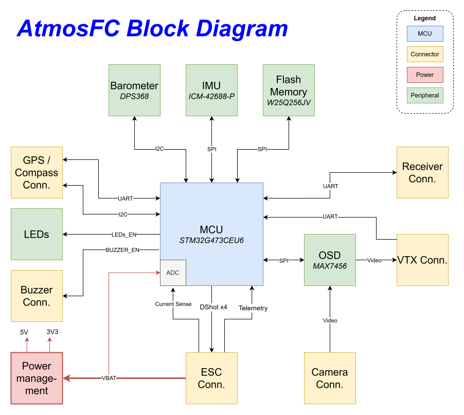
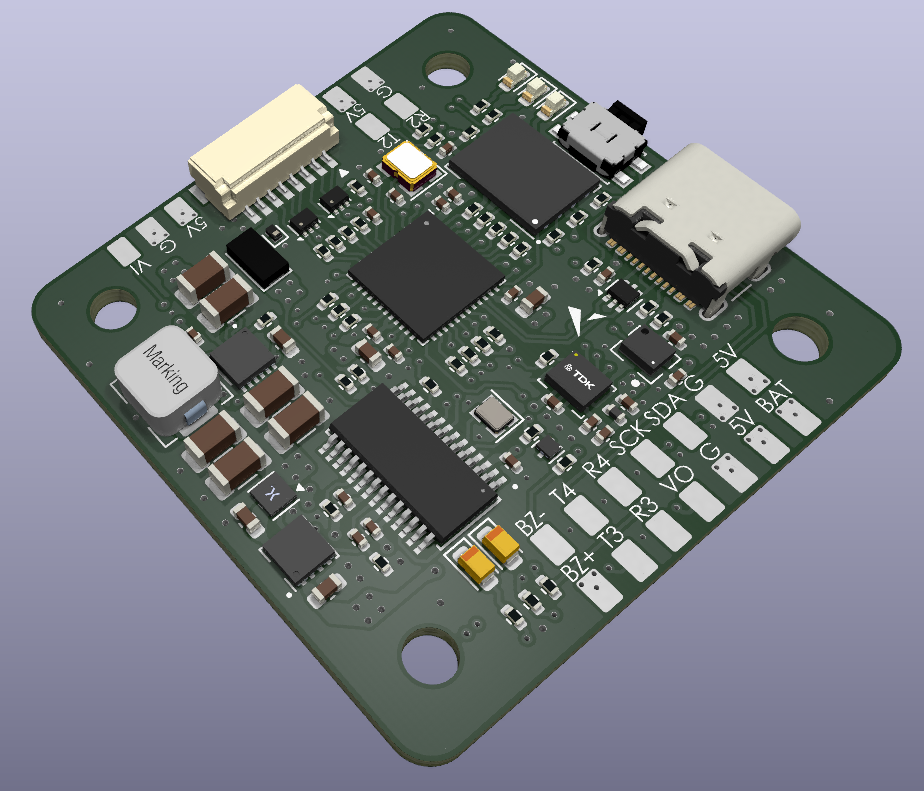

# AtmosFC

<p align="center">  </p> 

AtmosFC is an open-hardware quadcopter flight controller designed in KiCad. Powered by an STM32G4 MCU, it integrates high-performance sensors and peripherals, and is fully compatible with Betaflight (≥ 4.5).

<p align="center">  </p> 

## Table of Contents
- [Features](#features)
- [Input / Output](#input--output)
- [Hardware Architecture](#hardware-architecture)
- [Flashing Betaflight](#flashing-betaflight)
- [Notes](#notes)
- [Gallery](#gallery)
- [Repository Structure](#repository-structure)
- [License](#license)

## Features

- **MCU**: STM32G473CEU6
- **IMU**: ICM-468-P
- **Barometer**: DPS-386
- **OSD**: MAX7456 for analog on-screen display
- **Blackbox**: 32MB onboard flash memory for log recording
- **Power input**: Up to 8S
    > ⚠️   The board has been tested with 6S LiPo batteries. The onboard MAX25232 buck regulator can theoretically support up to 36 V (~ 8S LiPo), but this has not been tested. Use higher voltages at your own risk.
- **Power monitoring**: Battery voltage and current sensing
- **Status indicators**: Green, Blue, and Amber LEDs
- **Dimensions**: 40x40mm
- **Mounting holes**: 30.5×30.5 mm (M3)
- **Weight**: 8.2g

## Input / Output 

- **USB connector**: USB Type-C
- **Motor outputs**: x4
- **ESC**: Current sensing and telemetry
- **UARTs**: x3
- **I2C**: Yes
- **Video Input / Video Output with OSD** 
- **5V outputs**: up to 3A total 
- **Buzzer output**

## Hardware Architecture

The block diagram below shows the main hardware components and their interconnections.

<p align="center">  </p> 

##  Flashing Betaflight

AtmosFC runs **Betaflight ≥ 4.5**. You can either flash the precompiled Betaflight 4.5 firmware or build the latest from source.

### Option 1 – Using the provided firmware
1. Open **Betaflight Configurator**.  
   If you don’t have it installed, get the latest version here : [Betaflight Configurator Releases](https://github.com/betaflight/betaflight-configurator/releases/latest)
3. Connect AtmosFC via USB-C.
4. If required, enter DFU mode (hold the BOOT button while plugging in USB).
5. In the Betaflight Configurator, go to **Firmware Flasher → Load firmware [Local]** and select the file `betaflight_4.5.0_ATMOSFC.hex` in `betaflight_config/`.
6. Click **Flash Firmware** and wait for the board to reboot.

### Option 2 – Building from Source

1. Clone the [Betaflight Repository](https://github.com/betaflight/betaflight) and install the required toolchain. Follow the official setup guide for your OS : [Betaflight Building Docs](https://betaflight.com/docs/category/building).
2. In the Betaflight root directory, update the target list by running:
```
> make configs
```
3. Add the AtmosFC board configuration by copying the folder `betaflight_config/ATMOSFC/` into `betaflight/src/config/configs`.
4. Build the firmware for AtmosFC target.
```
> make ATMOSFC
```
5. The compiled `.hex` file will be located under `betaflight/obj/`.
Flash it using **Betaflight Configurator** (follow the steps from Option 1).

## Notes 
- The board has been **successfully tested with Betaflight 4.5**. All basic functions, including motor outputs, sensors, LEDs, were working correctly.
- **I did not test the OSD feature**, as I was flying using digital FPV goggles instead of analog video.
- There is a small **voltage drop on the VBAT measurement** (~0.2-0.3V) due to the Schottky diode used for reverse polarity protection.  
  - This can be compensated either by applying a software offset in Betaflight, or by using an alternative reverse polarity protection method, such as a MOSFET-based circuit

## Gallery

<p align="center">
  
    <br>
  
    <br>
  
    <br>
  
    <br>
  
</p>

## Repository Structure

The repository is organized as follows:

``` bash
├── hardware/             
│   ├── atmos_fc/           # KiCad project files (.kicad_pcb, .sch, etc.)  
│   ├── assembly/           # Fabrication files (Gerber, BOM)
│   └── lib/                # Custom footprints, symbols, 3D models
├── betaflight_config/
│   ├── ATMOSFC/            # Board configuration for Betaflight ≥ 4.5
│   └── betaflight_4.5.0_ATMOSFC.hex    # Precompiled Betaflight 4.5 firmware
├── documentation/          # Schematic (.pdf), images, logo, block diagram
└── README.md
```

##  License

This project is released under the **[MIT License](LICENSE.txt)**.  
You are free to use, modify, and distribute it.
